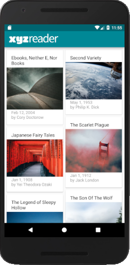
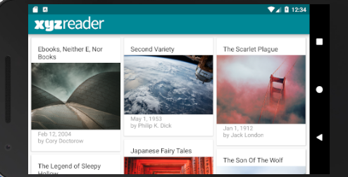

# Make Your App Material

### Goals
The purpose of this project is to apply Material Design principles to achieve maximum user experience.

### Starter Code
Follow this [repository](https://github.com/udacity/xyz-reader-starter-code) as a starter code.

### Project Guideline
- App uses the Design Support library and its provided widget types (FloatingActionButton, AppBarLayout, SnackBar, etc).
- App uses CoordinatorLayout for the main Activity.
- App theme extends from AppCompat.
- App uses an AppBar and associated Toolbars.
- App provides a Floating Action Button for the most common action(s).
- App properly specifies elevations for app bars, FABs, and other elements specified in the Material Design specification.
- App has a consistent color theme defined in styles.xml. Color theme does not impact usability of the app.
- App provides sufficient space between text and surrounding elements.
- App uses images that are high quality, specific, and full bleed.
- App uses fonts that are either the Android defaults, are complementary, and aren't otherwise distracting.
- App conforms to common standards found in the Android Nanodegree General Project Guidelines.
- App utilizes stable release versions of all libraries, Gradle, and Android Studio.

### Screenshot

